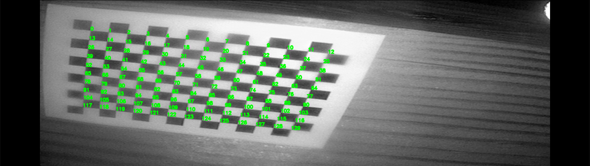
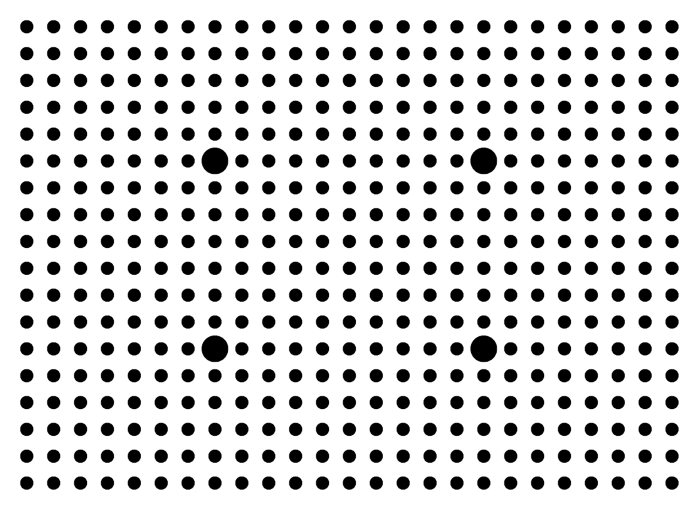
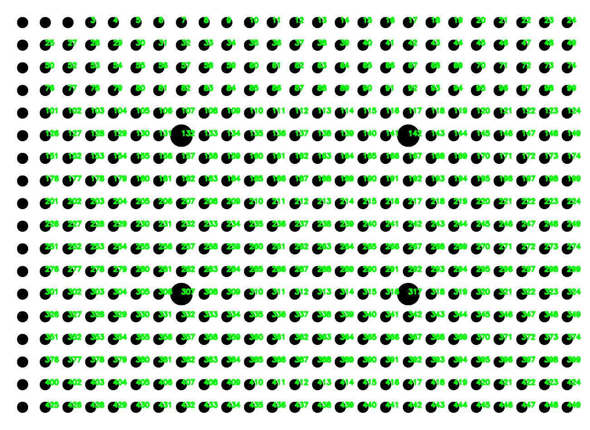
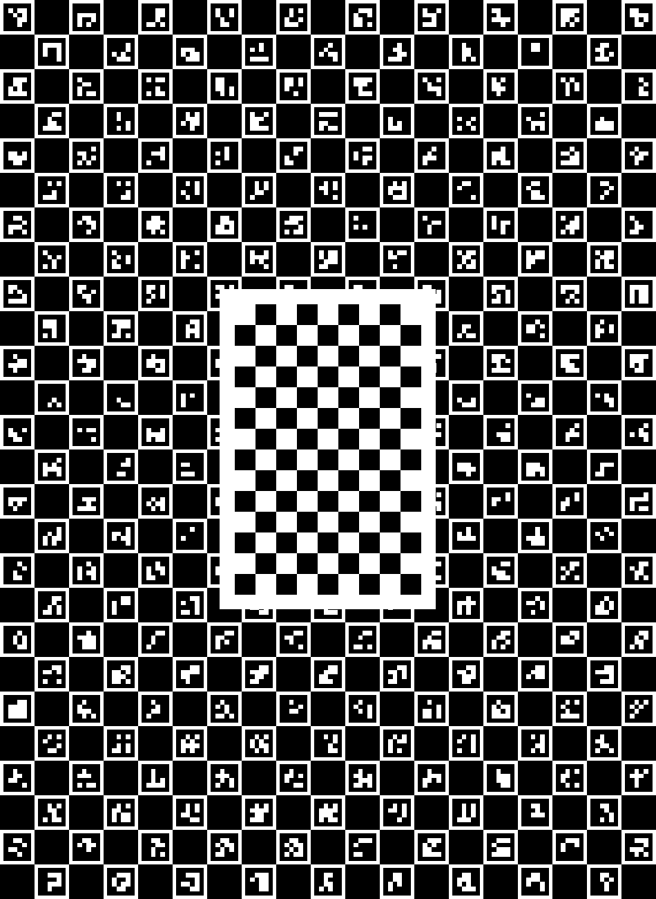
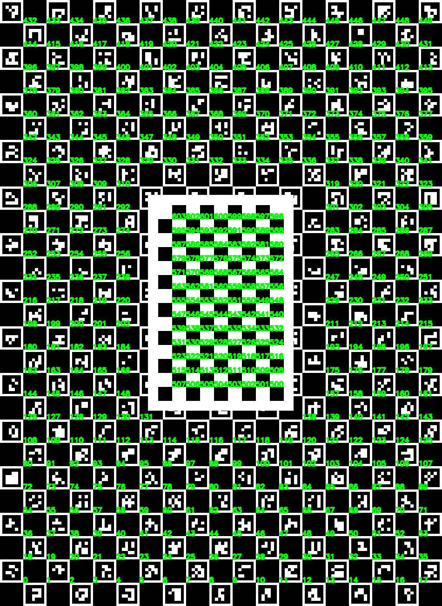

Chessboard/Point Detectors
^^^^^^^^^^^^^^^

All of the point detectors share a common `get_points(img)` method, which is called
to locate relevant points in the image, but each detector has a particualar set of initialisation parameters.

Chessboard Detector
-------------------

The chessboard detector requires the dimensions of the chessboard and the square size in mm as arguments to the constructor.

.. code-block:: python

    from sksurgeryimage.calibration.chessboard_point_detector import ChessboardPointDetector

    number_of_corners = (13, 10)
    square_size_mm = 3
    detector = ChessboardPointDetector(number_of_corners, square_size_mm)

    image = cv2.imread('tests/data/calib-ucl-chessboard/leftImage.png')
    ids, object_points, image_points = detector.get_points(image)

We can annoate the detected locations onto the original image:

.. code-block:: python

    for idx in range(ids.shape[0]):
        text = str(ids[idx][0])
        x = int(image_points[idx][0])
        y = int(image_points[idx][1])
        
        cv2.putText(image,
                    text,
                    (x, y),
                    cv2.FONT_HERSHEY_SIMPLEX,
                    0.5,
                    (0, 255, 0),
                    2,
                    cv2.LINE_AA)
    
    cv2.imwrite('annotated_image.png', image)

Dotty Grid Detector
-------------------

We will use this pattern to test the dotty grid detector, with 18 rows, 25 columns, 5mm between dot centres, and a resolution of 80 pixels per mm.

First, we generate the dot centres, based on the pattern parameters: 

.. literalinclude:: ../../tests/calibration/test_dotty_grid_point_detector.py
    :language: python
    :start-after: #Tutorial-section1-start
    :end-before: #Tutorial-section1-end

Then we setup the point detector, and pass in the test image. An initial set of intrinsic calibraiton parameters are required for this detector.

.. literalinclude:: ../../tests/calibration/test_dotty_grid_point_detector.py
    :language: python
    :start-after: #Tutorial-section2-start
    :end-before: #Tutorial-section2-end

We can visualise the results on the original grid, by annotating point markers:

.. literalinclude:: ../../tests/calibration/test_dotty_grid_point_detector.py
    :language: python
    :start-after: #Tutorial-section3-start
    :end-before: #Tutorial-section3-end

.. code-block:: python
  code cv2.imwrite('dots_annotated.png', dot_pattern)

ChARuCo & Chessboard Detector
-----------------------------

Test image. 19 x 26 Aruco markers with size 5x4mm, 9x14 chessboard pattern with 3mm square sections.

Setup point detector:

.. literalinclude:: ../../tests/calibration/test_charuco_plus_chessboard_point_detector.py
    :language: python
    :start-after: #Tutorial-section1-start
    :end-before: #Tutorial-section1-end

Detect on image:

.. literalinclude:: ../../tests/calibration/test_charuco_plus_chessboard_point_detector.py
    :language: python
    :start-after: #Tutorial-section2-start
    :end-before: #Tutorial-section2-end

Annotate image with detected point markers:

.. literalinclude:: ../../tests/calibration/test_charuco_plus_chessboard_point_detector.py
    :language: python
    :start-after: #Tutorial-section3-start
    :end-before: #Tutorial-section3-end

.. code-block:: python
  code cv2.imwrite('charuco_chessboard_annotated.png', charuco_pattern)

